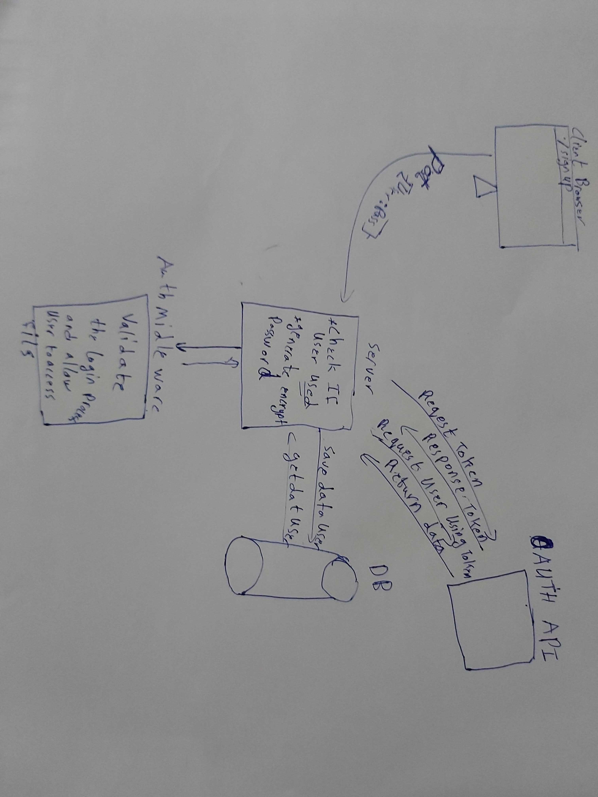

# LAB - 12

<!-- ## Project: Project Name Here -->
## OAuth Server

### Author: Mohammad Samara

### Links and Resources

* [submission PR](https://github.com/mohammad-samara/auth-server/pull/2)

### Documentation
<!-- * [jsdoc]() -->
<!-- * [swagger]()  -->

### Modules

#### `basic.js` , `500.js`, `404.js`, `mongo.js`, , `user-model.js`, `router.js`, `oauth.js`

##### Exported Values and Methods

* **`node index.js`**
  * This will start listening.
* **`router`**
  * This will send request to the user crud handler `users-model.js`
* **`users-model.js`**
  * This will connect the main crud handler `model.js` with the products schema `users-schema.js`
* **`model.js`**
  * This is the main crud handler.
* **`404.js`**
  * This will console for not exist route.
* **`500.js`**
  * This will console the server errors.
* **`basic.js`**
  * This will authinticate the login process
* **`oauth.js`**
  * This will make an authorization for the client from third-party.

### Setup

#### `.env` requirements

PORT = 4000  
**the others will be provided on canvas**

#### How to initialize your application

* `npm init -y`
* use git,postman or sawgger to use crud methods.

#### Running the app

* `npm start`
* Endpoint: `/`
* Endpoint: `/signup`
* Endpoint: `/signin`
* Endpoint: `/users`

#### Tests

* Unit Tests: `npm test`
* Lint Tests: `npm run lint`

<!-- Incomplete Tests: -->

#### UML

